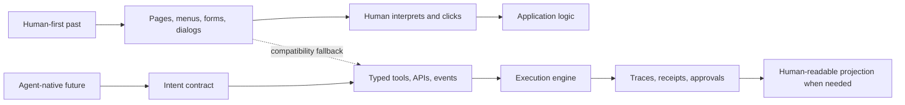
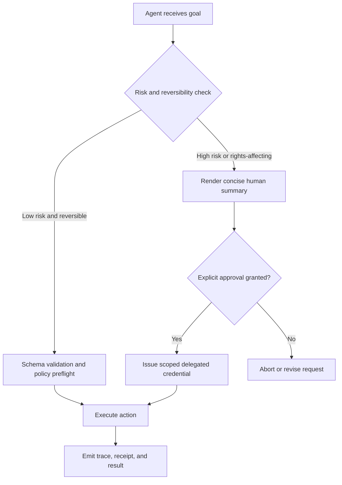

# Agent-Native Redesign Beyond Human-Centric Interfaces

## Executive summary

A large share of contemporary software is still shaped by the limits of human perception, memory, motor control, attention, and legal comprehension. HTML began as a language for describing scientific documents, forms were designed around manual data entry, command-line tools around memorized flags and prose help, WCAG link and labeling guidance around human wayfinding, email around text messages between computer users, and OAuth around browser-mediated approval interactions. Those choices were sensible when the primary actor was a person sitting at a screen. They are no longer the only sensible default when capable autonomous agents can inspect structure, invoke tools, follow workflows, consume event streams, and operate asynchronously. citeturn27view0turn20view2turn20view1turn27view1turn20view6turn21view0

The highest-value redesign opportunity is not “replace every GUI with an AI.” It is to move from **human-first surfaces with machine scraping as a fallback** to **machine-actionable contracts with human-readable projections as a fallback or approval boundary**. The enabling stack already exists in fragments: OpenAPI for discoverable capabilities, JSON Schema for typed inputs and outputs, Arazzo for multi-step workflows, MCP for model-discoverable tools, JSON-LD and Schema.org for semantic content and actions, Problem Details for typed failures, CloudEvents and WebSub for subscriptions, OpenTelemetry for observability, OAuth and DPoP for delegated authorization, and iCalendar/jCal for machine-readable scheduling. citeturn23view0turn22view5turn18view4turn22view2turn22view3turn23view1turn23view2turn22view0turn22view1turn18view6turn18view7turn26view2turn26view0turn21view0turn18view5turn21view6turn30view0

Research and product evidence strongly support this protocol-first direction. On OSWorld, humans complete more than 72.36% of computer tasks while the best tested model reached only 12.24%, showing that generic GUI operation is still brittle. By contrast, API-based and hybrid agents outperform pure browsing agents on WebArena; the latest “Beyond Browsing” result reports more than a 24-point absolute improvement over browsing alone and a 38.9% success rate. Anthropic’s computer-use tooling demonstrates that screenshot-plus-mouse-and-keyboard control is already viable for some desktop tasks, but Anthropic also notes that browser use sharply expands the prompt-injection attack surface. The implication is simple: **GUIs matter as a compatibility layer, but structured action surfaces are the better primary interface for agents.** citeturn18view0turn19view2turn19view3turn31view3turn18view2

The report’s central conclusion is that many artifacts no longer need to be primarily human-centric: command syntax, forms, wizards, search result pages, dashboards, notifications, newsletters, calendaring negotiation, URLs-as-navigation aids, and much of API documentation. However, some boundaries still do need human-centered treatment: high-stakes approval, rights-affecting consent, appealable decisions, and accessibility for real people. GDPR still defines consent in human terms, WCAG still centers people with disabilities, and NIST’s AI RMF still pushes trustworthiness and governance instead of fully autonomous substitution. The right target is **agent-native by default, human-legible where accountability requires it**. citeturn8search0turn8search17turn20view3turn20view4turn14search6

## Framing and assumptions

In this report, **agent-native** means that the primary interface is optimized for machine interpretation and execution: typed schemas, explicit preconditions, idempotent actions, machine-readable state transitions, event subscriptions, traceable outcomes, and scoped authority. Human-readable UI becomes a rendering of that underlying semantic layer, not the only source of truth. This framing follows the direction of OpenAPI, MCP, function calling, Arazzo, JSON-LD, and Schema.org Action: describe capabilities so software can discover and execute them directly. citeturn23view0turn22view2turn22view3turn23view6turn18view4turn23view1turn22view0turn22view1

The analysis assumes no specific platform constraint. It assumes agents can do at least some combination of tool use, schema following, web retrieval, browser automation, and desktop interaction. That assumption is now well-grounded: Toolformer showed models can learn when and how to call APIs; ReAct showed interleaved reasoning and acting improves task performance and interpretability; GAIA, WebArena, Mind2Web, OSWorld, and BrowserGym all evaluate increasingly realistic assistant behavior; and commercial tool stacks expose function calling, MCP-style tools, and computer-use interfaces. citeturn31view0turn31view1turn24view2turn24view0turn30view3turn30view4turn18view0turn6search1turn23view6turn22view3turn31view3

The report also assumes a human principal still exists for consequential actions. That is not just prudence; it reflects current legal and governance reality. GDPR consent must be freely given, specific, informed, and unambiguous. MCP authorization guidance explicitly recommends authorization for user-specific data and auditable actions. NIST’s AI RMF frames AI risk management around trustworthiness, oversight, measurement, and governance rather than hands-off delegation. citeturn8search0turn8search17turn21view2turn14search6

Finally, “no longer need to be human-centric” does **not** mean “humans no longer matter.” In several areas the opposite is true: accessibility semantics, consent receipts, audit trails, and approval summaries become more important, not less, because agents increase speed and scale. A useful design principle is therefore **dual-surface design**: a machine surface for execution and a human surface for review, exception handling, and accountability. citeturn20view4turn28view2turn29view1turn18view3

## Why the center of gravity is moving from interfaces to protocols

Human-centric interfaces emerged to solve human problems. People need descriptive link text to know where a link goes, labels to understand a control, menus to discover options, dashboards to spot patterns visually, tutorials to learn a sequence, and notifications to attract attention. HTML’s scope explicitly targets authoring accessible pages from static documents to occasional-use web applications; HTML inputs are “typed data fields” that usually let a **user** edit data; GNU standards explicitly call for `--help`, `--version`, command-line conventions, and formatted error messages for people operating programs; and OAuth assumes an approval interaction involving a resource owner and often a browser or separate user agent. citeturn27view0turn20view2turn33view0turn33view1turn21view0turn21view1

Agents remove or weaken many of those constraints. They do not need mnemonic flags when a tool manifest can expose names and argument schema. They do not need to “browse” a site map if a resource graph advertises `potentialAction`. They do not need a dashboard screenshot if the underlying metrics, traces, and logs are queryable and correlated. They do not need a prose wizard if a workflow specification exposes steps, dependencies, success criteria, and failure branches. They do not need an email digest if an event feed or webhook can stream material changes at machine speed. citeturn22view3turn22view1turn26view0turn26view1turn18view4turn18view7turn26view2

At the same time, the evidence argues against screen-centric agent design as the long-term default. OSWorld shows today’s broadly capable models still struggle badly with GUI grounding and operational knowledge, and Anthropic’s own browser-use security analysis says browser agents face a huge attack surface because every page, frame, ad, and dynamic script can carry hostile instructions. The most robust path is therefore not “teach agents to be better humans,” but “expose machine-grade semantics so agents do not need to imitate humans unless no better interface exists.” citeturn18view0turn18view2

That shift can be summarized as a stack inversion: the durable product is no longer the page, the menu, or the wizard; it is the **contract** that describes what can be done, under what authority, with what inputs, how success is verified, and how failure is reported. Human UI becomes one projection of that contract. Search engines already use structured data to understand pages, knowledge graphs already answer factual questions directly, Gmail already supports schema.org actions in email, and MCP Apps already lets tools return UI components inside an agent conversation instead of sending the user to a separate human-first destination page. citeturn20view5turn32view0turn21view7turn18view3



## Taxonomy and inventory of redesign opportunities

The taxonomy below groups redesign opportunities across communication, presentation, navigation, workflow, trust, collaboration, and semantics. The most important pattern is repeated in different domains: **replace perceptual affordances with executable semantics; keep human-facing renderings at approval and exception boundaries.** citeturn23view0turn22view3turn18view4turn18view6turn26view0

| Taxonomy | Traditional artifact | Why it was human-centric | What agent capabilities remove that need | Agent-native redesign | Impact / feasibility | Representative sources |
|---|---|---|---|---|---|---|
| Communication modality | OS command lines, flags, `--help`, man pages | Humans memorize verbs and flags, then rely on prose help and man pages for correction and discovery. | Models can discover tools dynamically and fill typed arguments from schema instead of composing shell syntax manually. | Publish every command as a tool manifest with JSON Schema; keep CLI as a renderer or escape hatch. | Very high / High | citeturn20view1turn33view1turn22view3turn23view6turn22view5 |
| Presentation layer | HTML pages with visual design | HTML evolved for semantically described documents and occasional-use web apps rendered for people. | Agents can consume structured data, APIs, and action metadata directly. | Make pages a projection over semantic content and actions exposed through JSON-LD, OpenAPI, and Schema.org `potentialAction`. | Very high / Medium-high | citeturn27view0turn20view5turn23view1turn23view2turn22view1 |
| Presentation layer | GUIs, menus, buttons, pointer navigation | Visual discovery and motor interaction help people find affordances and maintain context. | Agents can invoke tools or workflows directly, and can fall back to desktop/browser control only when necessary. | Replace primary GUI workflows with declarative task contracts, semantic selectors, and workflow specs; keep GUI automation as a fallback layer. | Very high / Medium | citeturn18view0turn31view3turn19view3turn20view4 |
| Communication modality | Human-speed speech, IVR trees, spoken walkthroughs | Speech is serial, time-bound, and paced for human comprehension. | Agents can ingest transcripts, action graphs, and text streams without waiting for conversational pacing. | Publish transcript-plus-intent feeds, structured actions, and optional synthesized speech as a rendering layer. | Medium / Medium | citeturn25search12turn25search18turn32view1 |
| Navigation | Search result pages and ranked snippets | Humans need snippets, breadcrumb context, and visual scanning to choose results. | Agents can act on structured entities, factual graphs, and action-capable resources directly. | Pair content with entity metadata and action endpoints so agents retrieve facts or trigger actions instead of scraping SERPs. | Very high / Medium-high | citeturn20view5turn32view0turn32view1 |
| Data entry | Forms and `application/x-www-form-urlencoded` payloads | Human web interaction centered on typing into visible controls and submitting form-encoded name/value pairs. | Agents can construct validated objects directly from context and schemas. | Replace visible forms with input schemas, preflight validation, and object submission; render forms only when a person must review or edit. | Very high / High | citeturn20view2turn33view3turn22view5 |
| Workflow scaffolding | Wizards, onboarding flows, prose tutorials | People need step-by-step cognitive scaffolding and explanatory sequencing. | Agents can follow machine-readable workflows, check preconditions, and retry branches programmatically. | Use Arazzo-style workflow descriptions, MCP tools, and executable examples instead of prose-only onboarding. | Very high / High | citeturn18view4turn22view2turn22view3turn34search0 |
| Documentation | API portals and docs written mainly for humans | Traditional API docs expect a developer to read prose, infer schema, and copy examples. | Agents can discover capabilities directly if the surface is described formally. | Treat prose docs as secondary; publish canonical OpenAPI, JSON Schema, examples, and workflow manifests. | Very high / High | citeturn23view0turn22view5turn18view4 |
| Failure communication | Human-written error messages and UX microcopy | People need natural-language explanations and reassurance when something fails. | Agents need stable codes, machine-readable context, and next-step guidance more than prose. | Use RFC 9457 Problem Details plus remediation fields, compensating actions, approval requests, and trace IDs. | High / High | citeturn18view6turn33view0turn26view1 |
| Monitoring | Dashboards and charts | Visual aggregation helps humans spot trends and anomalies. | Agents can subscribe to telemetry and evaluate policies continuously. | Surface traces, metrics, logs, and event rules as primary interface; render dashboards only for escalation and audit. | Very high / High | citeturn26view0turn26view1turn18view3 |
| Notification cadence | Popup notifications, badge counts, inbox nudges | Interruptions are designed to reclaim human attention. | Agents can process asynchronous event streams without interruption. | Replace attention-grabbing notifications with WebSub/CloudEvents subscriptions, rule engines, and task queues. | High / High | citeturn26view2turn18view7turn26view3 |
| Authentication and authorization | Browser redirects, device codes, session cookies | OAuth assumes a resource owner approval interaction, often mediated by a user agent or separate device. | Agents can use delegated, scoped, auditable credentials and proof-of-possession tokens. | Move toward least-privilege delegation, short-lived scoped tokens, DPoP, and explicit approval manifests. | Very high / Medium | citeturn21view0turn21view1turn21view2turn18view5 |
| Legal and consent | Consent dialogs, cookie banners, click-through approvals | Law and regulation require informed indication by a person, usually via visible notice and affirmative action. | Agents can carry structured grants and receipts, but cannot fully replace human awareness in rights-affecting contexts. | Use machine-readable grants, TC Strings, and consent receipts, but preserve human summaries and explicit approval where required. | High / Medium-low | citeturn8search0turn8search17turn28view2turn29view1 |
| Bot / abuse control | CAPTCHAs | CAPTCHAs are literally designed to separate humans from bots through human perception tasks. | Device attestation, privacy-preserving tokens, and risk signals can replace many explicit challenges. | Prefer silent attestation or token-based trust signals; use human challenge as last resort rather than default. | High / Medium | citeturn21view4turn21view5turn35search0turn35search1turn35search6 |
| Collaboration artifact | Email newsletters and narrative updates | Email format assumes text messages between computer users and encourages human reading and triage. | Agents can consume structured feeds, extract deltas, and act on embedded actions. | Publish Atom/RSS or CloudEvent change feeds, plus optional human digest emails with structured actions. | High / High | citeturn20view6turn10search1turn21view7turn26view2 |
| Collaboration artifact | Meeting schedules, calendar ping-pong, invite negotiation | Humans manually compare availability and negotiate slots. | Agents can read free/busy and availability data and optimize against constraints. | Use iCalendar free/busy, availability components, or jCal-style JSON as the primary scheduling interface; render invites for humans. | High / High | citeturn21view6turn20view7turn30view0 |
| Navigation / naming | URLs, breadcrumbs, file names, folder hierarchies | These help humans infer location, category, and meaning from strings. | Agents can use opaque IDs, metadata, and content indexes instead of semantic path guessing. | Treat visible names as projections over canonical resource IDs and metadata; expose relationships separately from names. | Medium / Medium | citeturn33view2turn33view3turn36search2turn36search9 |
| Human support semantics | Accessibility labels, landmarks, ARIA roles, descriptive link text | These were created for assistive technology and human comprehension. | Agents can use the same semantics as a stable machine interface layer. | Do not drop them; elevate them into first-class agent semantics and test them as part of API/UI correctness. | Very high / High | citeturn20view3turn20view4turn32view2turn27view1 |

One important asymmetry appears repeatedly in the table. Artifacts like forms, menus, dashboards, newsletters, and wizards are mostly **compensations for human limitations**. Artifacts like accessibility labels, approval summaries, and consent receipts are increasingly **shared infrastructure** for both humans and agents. Those should not be removed; they should be strengthened and formalized. citeturn20view4turn27view1turn29view1

## Comparison matrix and concrete prototypes

The traditional and agent-native designs differ less in business purpose than in interaction primitives. Traditional UX packages meaning into pages, dialogs, prose, and visual sequences. Agent-native design packages meaning into schemas, permissions, events, workflows, and traces. Standards such as OpenAPI, MCP, Arazzo, Problem Details, CloudEvents, OpenTelemetry, OAuth, and Schema.org already imply this shift. citeturn23view0turn22view3turn18view4turn18view6turn18view7turn26view0turn21view0turn22view0

| Attribute | Traditional human-centric design | Agent-native design |
|---|---|---|
| Purpose expression | Prose, copy, screens, examples | Schemas, contracts, policies, workflows |
| Primary audience | Human end user or developer | Agent first, human principal second |
| Interaction unit | Click, page, form, menu, dialog | Action object, tool call, workflow step, event |
| Latency model | Synchronous session paced by humans | Asynchronous, resumable, machine speed |
| Discoverability | Visual navigation and documentation | Capability discovery via manifests and metadata |
| State visibility | Implicit in UI and page flow | Explicit in machine-readable state and traces |
| Observability | Screenshots, dashboards, support tickets | Correlated traces, logs, metrics, receipts |
| Verifiability | Manual checking, screenshots, prose explanations | Typed inputs, deterministic outputs, replayable steps, trace IDs |
| Security model | Cookies, CAPTCHAs, browser redirects | Scoped delegation, proof-of-possession, attestation, policy checks |
| Human role | Operating the whole flow | Setting goals, granting authority, reviewing exceptions |

In practice, the winning pattern is usually **agent-native core plus optional human UI projection**, not a hard fork between “AI mode” and “human mode.” MCP Apps is a good recent example: tools can return forms, dashboards, visualizations, and multi-step workflows directly inside the conversation, which means UI becomes a result of tool execution rather than the primary place where logic lives. citeturn18view3

The following prototypes illustrate concrete replacements.

The first prototype replaces a human-facing form, CLI syntax, or “wizard” step sequence with a machine-actionable tool contract built out of the same design ideas used in MCP tools, JSON Schema, and function calling. citeturn22view3turn22view5turn23view6

```json
{
  "name": "submit_expense_report",
  "description": "Create and submit an expense report for reimbursement.",
  "input_schema": {
    "type": "object",
    "required": ["employee_id", "currency", "items"],
    "properties": {
      "employee_id": { "type": "string" },
      "currency": { "type": "string", "pattern": "^[A-Z]{3}$" },
      "items": {
        "type": "array",
        "items": {
          "type": "object",
          "required": ["date", "category", "amount", "receipt_uri"],
          "properties": {
            "date": { "type": "string", "format": "date" },
            "category": { "type": "string", "enum": ["travel", "meals", "lodging", "supplies"] },
            "amount": { "type": "number", "minimum": 0 },
            "receipt_uri": { "type": "string", "format": "uri" }
          }
        }
      },
      "manager_approval_required": { "type": "boolean", "default": true }
    }
  },
  "preflight_checks": [
    "employee_is_active",
    "receipts_are_reachable",
    "policy_limits_respected"
  ],
  "idempotency_key": "expense_report_hash",
  "compensating_action": "withdraw_expense_report"
}
```

The second prototype shows how a prose onboarding flow or multi-page wizard can become a workflow artifact. This is the direction formalized by Arazzo: express steps, dependencies, and outcomes directly. citeturn18view4

```yaml
arazzo: 1.1.0
info:
  title: Vendor onboarding workflow
  version: 1.0.0
sourceDescriptions:
  - name: vendor-api
    type: openapi
    url: https://api.example.com/openapi.yaml
workflows:
  - workflowId: onboardVendor
    summary: Complete vendor onboarding with human approval only for tax and payout changes
    steps:
      - stepId: createVendor
        operationId: createVendor
      - stepId: validateTax
        operationId: validateTaxProfile
        dependsOn: [createVendor]
      - stepId: requestApproval
        operationId: requestHumanApproval
        dependsOn: [validateTax]
        when: "$steps.validateTax.output.risk_score > 0.7"
      - stepId: enablePayments
        operationId: enableVendorPayouts
        dependsOn: [validateTax, requestApproval]
```

The third prototype replaces a human-oriented landing page or search result with semantic content plus an executable action. Search engines and email clients already consume structures like this. citeturn20view5turn23view2turn22view1turn21view7

```json
{
  "@context": "https://schema.org",
  "@type": "Service",
  "name": "Acme Travel Booking",
  "description": "Business travel booking and itinerary management.",
  "provider": { "@type": "Organization", "name": "Acme Travel" },
  "potentialAction": {
    "@type": "ReserveAction",
    "name": "Book a flight",
    "target": {
      "@type": "EntryPoint",
      "urlTemplate": "https://api.acme.example/travel/book-flight",
      "httpMethod": "POST",
      "encodingType": "application/json"
    }
  }
}
```

The fourth prototype replaces prose-only errors and support copy with typed failure objects. RFC 9457 gives the base pattern; the extension below adds agent-remediation fields. citeturn18view6

```json
{
  "type": "https://api.example.com/problems/approval-required",
  "title": "Approval required",
  "status": 403,
  "detail": "Travel spend exceeds auto-approval threshold.",
  "instance": "urn:trace:9f4b4bd2-1d77-4ac2",
  "required_approvals": [
    { "role": "manager", "max_wait": "PT8H" }
  ],
  "next_actions": [
    {
      "tool": "request_human_approval",
      "input": {
        "summary": "Approve round-trip travel from MAD to JFK, estimated cost €2,480",
        "expires_at": "2026-06-16T17:00:00Z"
      }
    }
  ],
  "retriable": true
}
```

The fifth prototype replaces human-facing notifications and dashboard polling with an event object that any agent or service can route, subscribe to, or correlate with traces. citeturn18view7turn26view0turn26view2

```json
{
  "specversion": "1.0",
  "id": "evt-01JY7N5A4M",
  "source": "urn:acme:billing",
  "type": "invoice.approval.required",
  "subject": "invoice/INV-20491",
  "time": "2026-06-15T09:31:48Z",
  "datacontenttype": "application/json",
  "data": {
    "amount": 18420.00,
    "currency": "EUR",
    "risk_score": 0.81,
    "trace_id": "9f4b4bd2-1d77-4ac2",
    "approval_uri": "https://api.acme.example/approvals/INV-20491"
  }
}
```

A final observation ties these prototypes together. They all expose the same core properties: typed inputs, explicit preconditions, traceable execution, principled failure, and selective human involvement. That common shape is why agent-native redesign can be cross-domain rather than interface-specific. citeturn22view5turn18view4turn18view6turn26view0

## Priorities, risks, and mitigations

The best roadmap is to prioritize redesigns where machine semantics already exist or where browsing can be replaced with structured alternatives immediately. API and workflow descriptions, event streams, typed failures, search semantics, and scheduling data are the lowest-regret targets. Full GUI replacement is not. citeturn19view3turn18view0turn18view4turn18view7

| Recommendation | Why it is high leverage now | Impact | Feasibility | Main failure mode | Mitigation | Evidence |
|---|---|---:|---:|---|---|---|
| Publish canonical action contracts for all high-value workflows | Removes guesswork, replaces form-filling and CLI memorization, and makes capabilities consumable by both humans and agents. | Very high | High | Stale or partial schemas | Make schema the source of truth; version it; validate and test against live behavior. | citeturn23view0turn22view3turn23view6 |
| Publish machine-readable workflows for multi-step tasks | Collapses wizards and prose tutorials into executable flow definitions. | Very high | High | Hidden dependencies or side effects | Encode preconditions, outputs, and compensation paths in the workflow. | citeturn18view4 |
| Replace visual status UIs with event streams and telemetry | Lets agents act continuously instead of waiting for people to notice a dashboard or email. | Very high | High | Alert storms and opaque automation | Use policy filters, routing rules, trace IDs, and human escalation thresholds. | citeturn18view7turn26view0turn26view1 |
| Add semantic content and actions to web and email surfaces | Allows agents to consume search/content/email artifacts without brittle scraping. | High | Medium-high | Search/display behavior changes faster than schemas | Treat semantic markup as the durable layer and visual presentation as expendable. | citeturn20view5turn23view2turn21view7turn34search1 |
| Move from browser-first auth to delegated scoped credentials | Avoids human-loop logins for routine agent work while keeping authority narrow and auditable. | Very high | Medium | Overbroad delegation or token replay | Use short-lived scopes, DPoP, audit trails, and approval steps for new scopes. | citeturn21view0turn18view5turn21view2 |
| Keep browser/desktop automation as fallback only | Current generic GUI performance is still weak and the attack surface is large. | High | Medium | Prompt injection and GUI brittleness | Prefer API/hybrid paths, sandboxing, allow-lists, download controls, and human checkpoints. | citeturn18view0turn18view2turn19view2turn31view3 |

The main security risk is the **confused deputy problem amplified by natural language**. OWASP ranks prompt injection as a leading risk for LLM applications, and Anthropic’s browser-use analysis explains why browser agents are particularly exposed: they continuously ingest untrusted content while also holding the ability to click, submit, download, and navigate. This is the strongest argument for typed contracts and constrained tools over free-form browsing. citeturn14search0turn14search8turn18view2

The main governance risk is **delegating authority without preserving intelligibility and evidence**. GDPR’s definition of consent is still person-centered. Existing ad-tech infrastructure already uses a machine-readable TC String, and consent receipt specifications already describe both JSON receipts and human-readable presentation. That points to a workable hybrid: the machine carries the grant, but the human sees a concise summary, scope, expiry, and reversal path. citeturn8search0turn8search17turn28view2turn29view1

The main operational risk is **opaque automation without replayable evidence**. Agent-native systems should emit traces, metrics, logs, problem envelopes, and receipts as part of the interface, not as a separate observability add-on. OpenTelemetry, Problem Details, and event schemas exist precisely to make distributed execution inspectable and automatable. citeturn26view0turn26view1turn18view6turn18view7



A practical mitigation hierarchy follows from the chart. First prefer an API or tool contract over browser use. Then prefer a hybrid path over raw GUI control. Then constrain authority before execution. Then emit enough evidence for replay and appeal. Only after those steps should you optimize the cosmetic human UI. That ordering is consistent with both benchmark evidence and the current security literature. citeturn19view3turn18view0turn18view2turn14search6

## Design patterns and recommendations

The design patterns below are the report’s condensed guidance for designers and engineers. They are phrased to be implementable across web, OS, enterprise software, developer platforms, communications systems, and internal automation tools. The most important shift is to treat semantics, policy, and observability as UX primitives. citeturn23view0turn22view3turn18view4turn26view1

| Pattern | What to do | Why it matters |
|---|---|---|
| Contract before chrome | Define actions, schemas, and states before designing pages or dialogs. | UI will change faster than semantic contracts. |
| Intent over navigation | Let callers name the outcome they want, not the menu path they would click. | Agents should not have to simulate breadcrumb traversal. |
| Projection, not duplication | Generate human UI from the same source of truth used by agents. | Prevents drift between “AI mode” and “manual mode.” |
| Typed failure over prose failure | Return stable codes, fields, and remediation steps; add prose only as a companion. | Agents need deterministic recovery. |
| Events over interrupts | Publish subscriptions and event objects instead of popup-driven attention requests. | Machines handle asynchronous change better than people. |
| Receipts for consequential actions | Emit trace IDs, approval records, consent records, and outcome summaries. | Accountability scales only if evidence is first-class. |
| Least privilege with proof-of-possession | Scope credentials narrowly and bind them to the client or session. | Stolen bearer tokens and over-grants are unacceptable at agent scale. |
| Accessibility semantics as machine semantics | Treat accessible names, landmarks, roles, and link purpose as stable action metadata. | The accessibility tree is an excellent agent control plane. |
| Hybrid fallback | Support browser/desktop control only when no structured alternative exists. | Generic GUI control is still brittle and risky. |
| Reversible first | Design compensating actions, dry runs, and preflight checks into every workflow. | Agents will make mistakes; reversible systems fail better. |

The concrete recommendation set for the next design cycle is straightforward. First, publish capability contracts and workflow manifests for the top twenty user tasks. Second, expose state changes as events and telemetry rather than only dashboards and email. Third, attach semantic actions to public content, support content, and emails. Fourth, redesign authorization around narrow, expiring grants and approval checkpoints. Fifth, reframe accessibility metadata as universal semantic infrastructure, not a compliance afterthought. Organizations that do those five things will remove more human-centric friction than those that spend the same effort on teaching agents to click faster. citeturn23view0turn18view4turn18view7turn21view0turn18view5turn20view4

A useful implementation sequence is also clear. Build the semantic layer first, then the execution layer, then the governance layer, and only then simplify or retire legacy human-first UX. If that order is reversed, teams usually end up with fragile browser automation wrapped around interfaces that were never intended to be machine-operated. The standards and benchmark evidence both argue against that trap. citeturn19view3turn18view0turn18view4

## Open questions and limitations

The biggest unresolved area is legal delegation. Standards and precedents exist for consent strings, consent receipts, delegated authorization, and auditable approvals, but public law and platform norms still mostly assume a person is the direct interface participant. That makes “agent-consent” workable in some operational settings, but not fully settled for all rights-affecting or public-facing decisions. citeturn8search0turn28view2turn21view0turn21view2

The second limitation is capability reliability at the GUI layer. General agents can already browse, use tools, and operate desktop environments, but the gap between bounded demos and broad real-world GUI competence remains large. The recommendation to treat GUI automation as fallback, not primary architecture, is therefore a high-confidence design choice; any stronger claim about replacing most GUIs outright would be premature. citeturn18view0turn31view3turn19view2

The third limitation is standards fragmentation. MCP, OpenAPI, Arazzo, Schema.org, CloudEvents, OpenTelemetry, OAuth, DPoP, Privacy Pass, and consent frameworks are converging toward an agent-native stack, but they do not yet form a single end-to-end canonical architecture. Teams will still need integration design work, especially around identity, permissioning, receipts, and action semantics. citeturn22view2turn23view0turn18view4turn23view2turn18view7turn26view1turn21view0turn18view5turn35search8

The fourth limitation is evidentiary depth by artifact class. Some domains in this report are grounded by mature primary standards and benchmarks; others, especially file naming conventions and organization-specific collaboration artifacts, are more convention-driven than specification-driven. The design recommendations for those cases are therefore architectural in nature: decouple human-readable names from canonical identifiers, and publish machine-readable metadata wherever practical. citeturn33view2turn33view3turn36search2turn36search9